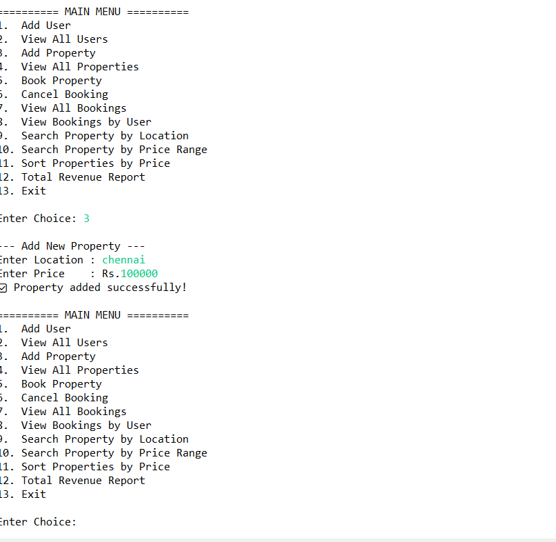
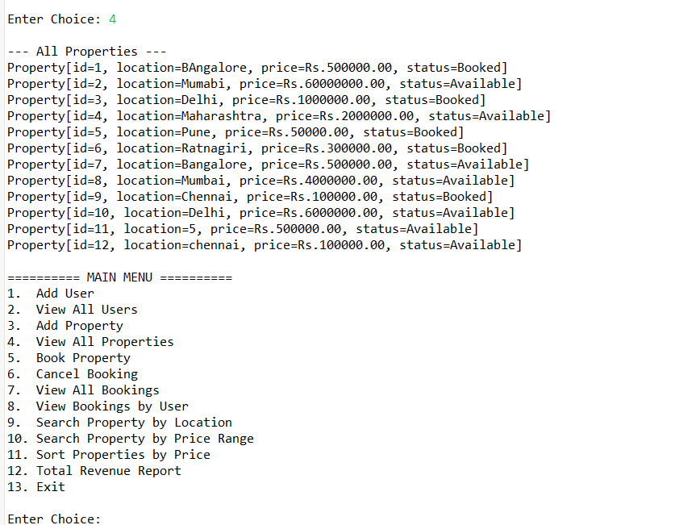
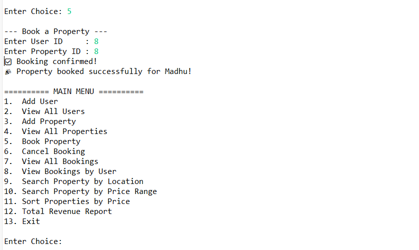
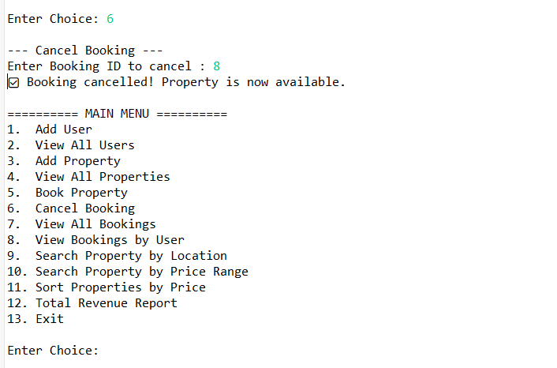
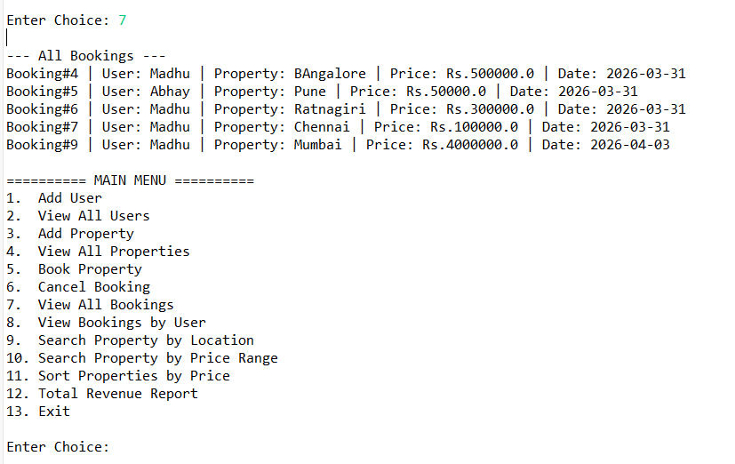
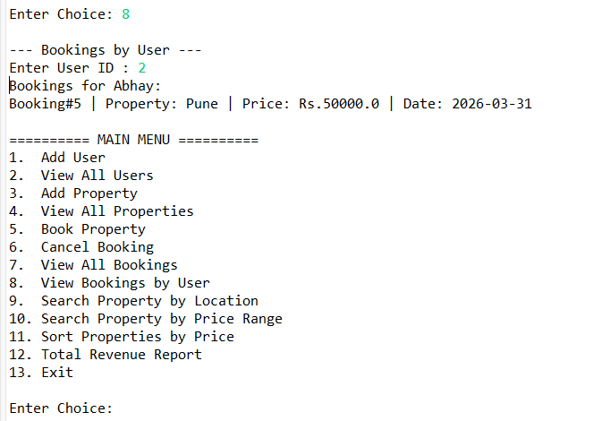
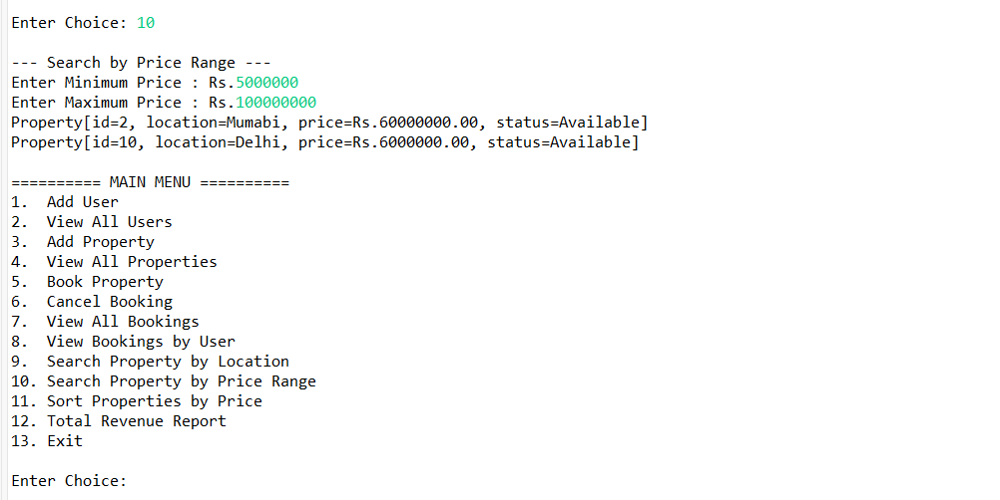
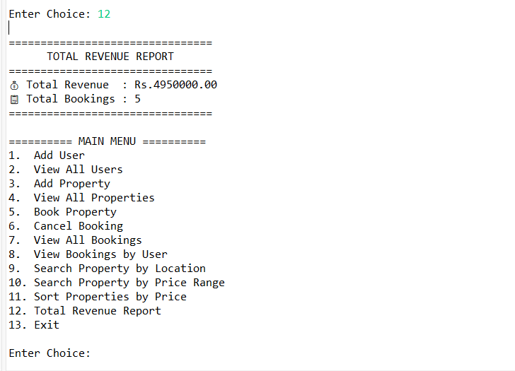
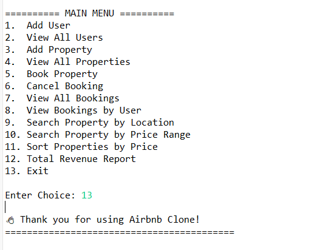

# 🏠 Airbnb Clone — Booking Platform Backend

A property booking backend built with **Java, Spring Boot, MySQL and raw JDBC** (no ORM). It covers user registration and authentication, property listings with location and price-range search, booking and cancellation, double-booking prevention, and SQL revenue reports.

## 🔧 Tech Stack

- Java 17
- Spring Boot (layered architecture)
- MySQL with JDBC (hand-written SQL, no ORM)
- REST APIs
- Maven
- Git

## 💡 Features

- User registration and authentication
- Property listing with location and price-range search
- Booking and cancellation flows
- Double-booking prevention logic
- Revenue reporting using SQL JOINs and GROUP BY

## 📐 Architecture

```
Client → Controller → Service → Repository → MySQL
```

- **Controller:** handles HTTP requests and responses
- **Service:** business logic such as booking rules and availability checks
- **Repository:** all JDBC and SQL access; business logic never touches the database directly

## 🗂️ Project Structure

```
airbnb-clone-java/
├── database/    → SQL schema for MySQL
├── src/         → Java source code
├── *.png        → Application screenshots
└── README.md
```

## 🚀 How to Run

**Prerequisites:** Java 17, Maven, MySQL

1. Clone the repository:
   ```
   git clone https://github.com/Madhumitha-divate/airbnb-clone-java.git
   cd airbnb-clone-java
   ```
2. Create a MySQL database and import the SQL schema file from the `database/` folder.
3. Open `application.properties` and set your MySQL URL, username and password.
4. Start the application:
   ```
   mvn spring-boot:run
   ```

## 📸 Screenshots

| | | |
|---|---|---|
|  |  |  |
|  |  |  |
|  |  |  |
|  |  | |

## 🔮 Future Improvements

- Add unit tests for the service layer
- Add API documentation with Swagger / OpenAPI
- Add pagination to search results
- Add Docker support

## 👩‍💻 Author

**Madhumitha Divate**

- LinkedIn: https://www.linkedin.com/in/madhumitha-divate/
- GitHub: https://github.com/Madhumitha-divate
